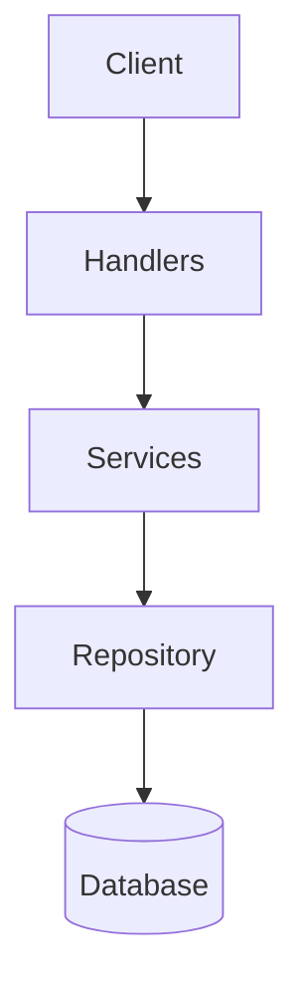

<!-- # Go REST API with Clean Architecture -->
<!-- <p align="center"></p> -->
 <!-- <p align="center"></p> -->
 <p align="center"></p>
This is a RESTful API built using Go (Golang) that follows the principles of clean architecture. It includes CRUD operations for managing products in an inventory, OpenAPI documentation using Swagger, and a PostgreSQL database.

---

## Table of Contents

1. [Project Setup](#project-setup)
2. [OpenAPI Documentation](#openapi-documentation)
3. [Clean Architecture Overview](#clean-architecture-overview)

---

## Project Setup

### Prerequisites

Before running the project, ensure you have the following installed:
- **Install Go**: (Mac)
   ```bash
   brew install go
   ```
- **PostgreSQL**: Install and configure PostgreSQL locally or use a Docker container.
- **Swagger CLI (`swag`)**: Install using:
  ```bash
  go install github.com/swaggo/swag/cmd/swag@latest
  ```

### Steps to Set Up the Project

1. **Clone the Repository**
   ```bash
   git clone https://github.com/Syed-Rehan-21/GO-lang-.git
   cd GO-lang-
   ```

2. **Install Dependencies**
   ```bash
   go mod tidy
   ```

3. **Set Up Environment Variables**
   - Create a `.env` file in the root directory with the following content:
     ```env
     DATABASE_HOST=localhost
     DATABASE_PORT=5432
     DATABASE_USER=your_user
     DATABASE_PASSWORD=your_password
     DATABASE_NAME=your_db
     API_PORT=8080
     ```
   - Replace placeholders (`your_user`, `your_password`, etc.) with your actual database credentials.

4. **Run Database Migrations**
   - Ensure your PostgreSQL database is running.
   - The application automatically creates the `products` table on startup. If needed, you can manually create it using:
     ```sql
     CREATE TABLE products (
         id SERIAL PRIMARY KEY,
         name VARCHAR(255) NOT NULL,
         quantity INTEGER NOT NULL,
         price DECIMAL(10, 2) NOT NULL
     );
     ```

5. **Start the Application**
   ```bash
   go run cmd/api/main.go
   ```

6. **Access the API**
   - The API will be available at `http://localhost:8080`.
   - Swagger UI will be accessible at `http://localhost:8080/api/docs/swagger-ui/`.

7. **Generate Swagger Documentation**
   - Run the following command to generate OpenAPI documentation:
     ```bash
     swag init -g cmd/api/main.go -o api/docs
     ```

---

## OpenAPI Documentation

### What is OpenAPI?
OpenAPI (formerly Swagger) is a standard for defining RESTful APIs. It allows developers to describe their APIs in a machine-readable format (JSON or YAML) and provides tools like Swagger UI for interactive documentation.

### Swagger Annotations
Each endpoint in the API is documented using Swagger annotations. Below is an example of how these annotations are used:

#### Example: `GET /products`
```go
// @Summary Get all products
// @Description Retrieves a list of all products in the inventory.
// @Tags products
// @Produce json
// @Success 200 {array} models.Product
// @Failure 500 {object} map[string]string
// @Router /products [get]
func (h *ProductHandler) GetAllProductsHandler(w http.ResponseWriter, r *http.Request) {
    // Implementation...
}
```

#### Annotation Breakdown
| Tag           | Description                                                                 |
|---------------|-----------------------------------------------------------------------------|
| `@Summary`    | A short description of the endpoint.                                       |
| `@Description`| A detailed explanation of the endpoint's purpose.                          |
| `@Tags`       | Groups the endpoint under a specific category (e.g., "products").          |
| `@Produce`    | Specifies the response format (e.g., `json`).                              |
| `@Success`    | Describes the successful response (HTTP status code and response schema).  |
| `@Failure`    | Describes error responses (HTTP status code and error message schema).     |
| `@Router`     | Defines the HTTP method and path for the endpoint (e.g., `GET /products`). |

### Generating Swagger Files
Run the following command to generate the OpenAPI documentation:
```bash
swag init -g cmd/api/main.go -o api/docs
```

This will create the following files in `api/docs`:
- `swagger.json`: OpenAPI specification in JSON format.
- `swagger.yaml`: OpenAPI specification in YAML format.
- `docs.go`: Embedded documentation for Go.

---

## Clean Architecture Overview

### What is Clean Architecture?
Clean architecture is a software design philosophy that emphasizes separation of concerns and modularity. It divides the application into layers, each with a specific responsibility, making the codebase easier to maintain, test, and scale.

### Layers in This Project

| Layer        | Responsibility                                                                 |
|--------------|---------------------------------------------------------------------------------|
| **Handlers** | Handle HTTP requests and responses.                                            |
| **Services** | Implement business logic and orchestrate operations.                           |
| **Repository**| Interact with the database and perform CRUD operations.                       |

### Interaction Between Layers

The interaction between layers follows a top-down approach:

1. **Handler → Service**: Handlers call service methods to process requests.
2. **Service → Repository**: Services call repository methods to interact with the database.

#### Mermaid Flow Diagram


### Example Workflow: Creating a Product

#### 1. Handler Layer
The handler receives the HTTP request and calls the service layer:
```go
func (h *ProductHandler) CreateProductHandler(w http.ResponseWriter, r *http.Request) {
    var input models.ProductInput
    if err := json.NewDecoder(r.Body).Decode(&input); err != nil {
        http.Error(w, "Invalid request body", http.StatusBadRequest)
        return
    }
    product, err := h.Service.CreateProduct(input)
    if err != nil {
        http.Error(w, err.Error(), http.StatusBadRequest)
        return
    }
    w.Header().Set("Content-Type", "application/json")
    w.WriteHeader(http.StatusCreated)
    json.NewEncoder(w).Encode(product)
}
```

#### 2. Service Layer
The service validates the input and calls the repository layer:
```go
func (s *ProductService) CreateProduct(input models.ProductInput) (*models.Product, error) {
    if input.Quantity <= 0 {
        return nil, errors.New("quantity must be greater than zero")
    }
    if input.Price <= 0 {
        return nil, errors.New("price must be greater than zero")
    }
    return s.Repo.CreateProduct(input)
}
```

#### 3. Repository Layer
The repository executes the SQL query to insert the product into the database:
```go
func (r *ProductRepository) CreateProduct(product models.ProductInput) (*models.Product, error) {
    query := `
        INSERT INTO products (name, quantity, price)
        VALUES ($1, $2, $3)
        RETURNING id, name, quantity, price
    `
    var newProduct models.Product
    err := r.DB.QueryRow(query, product.Name, product.Quantity, product.Price).
        Scan(&newProduct.ID, &newProduct.Name, &newProduct.Quantity, &newProduct.Price)
    if err != nil {
        return nil, fmt.Errorf("failed to create product: %w", err)
    }
    return &newProduct, nil
}
